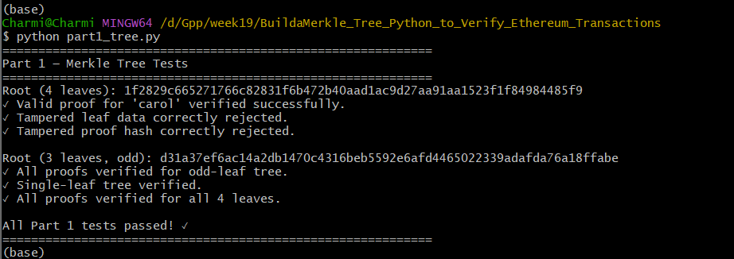
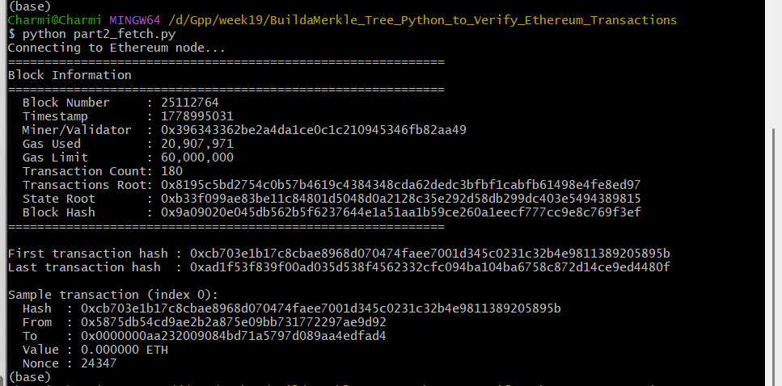
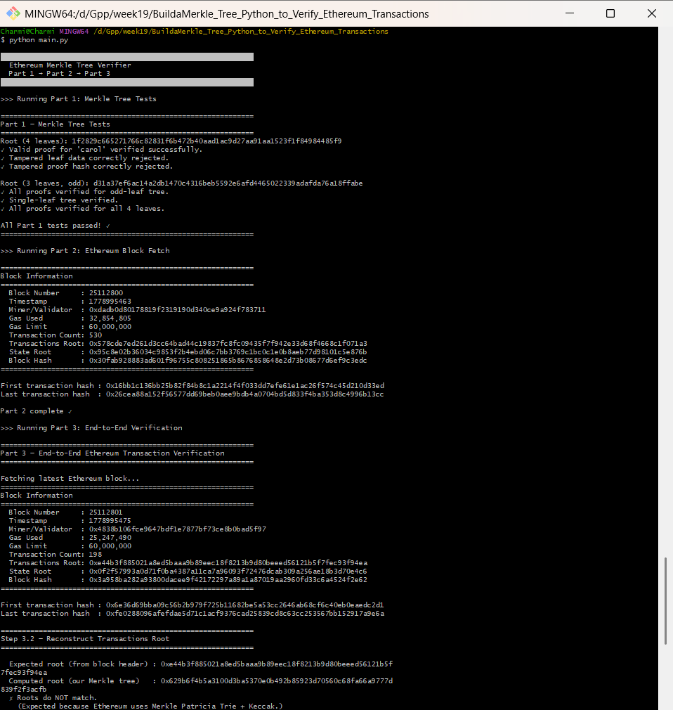
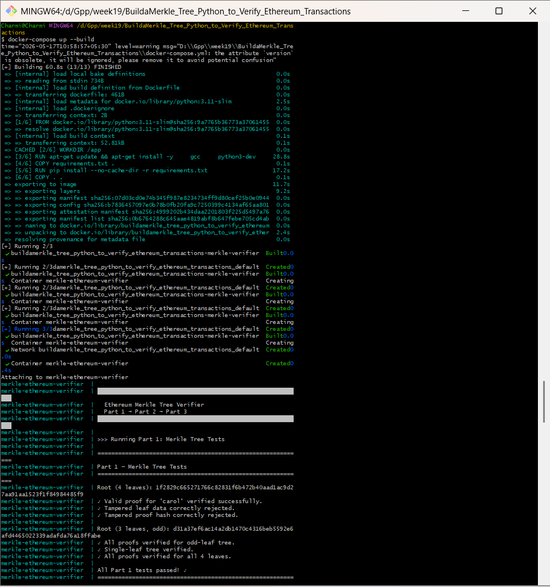

# Ethereum Merkle Tree Verifier

A Python implementation of a Merkle tree used to verify real Ethereum transaction inclusion. Covers cryptographic hashing, tree-based data structures, Merkle proofs, and Ethereum's JSON-RPC API.

---

## Table of Contents

- [Overview](#overview)
- [Project Structure](#project-structure)
- [Prerequisites](#prerequisites)
- [Setup](#setup)
- [Running Locally (without Docker)](#running-locally-without-docker)
- [Running with Docker](#running-with-docker)
- [Getting an RPC Key](#getting-an-rpc-key)
- [What Each Part Does](#what-each-part-does)
- [Extension Challenges](#extension-challenges)
- [Key Concepts](#key-concepts)

---

## Overview

This project implements:

1. **Part 1** — A full Merkle tree from scratch: leaf hashing, tree construction, proof generation, and standalone proof verification.
2. **Part 2** — Ethereum block and transaction fetching via the `eth_getBlockByNumber` JSON-RPC method.
3. **Part 3** — End-to-end verification: reconstruct the transaction Merkle root from a real block and prove transaction inclusion.

---

## Project Structure

```
ethereum-merkle-tree-verifier/
├── part1_tree.py       # MerkleTree class, proof generation & verification
├── part2_fetch.py      # Ethereum JSON-RPC block/tx fetching
├── part3_verify.py     # Root reconstruction, inclusion proofs, light client simulation
├── main.py             # Runs all three parts in sequence
├── requirements.txt    # Python dependencies
├── Dockerfile          # Container build spec
├── docker-compose.yml  # Container orchestration
├── .env.example        # Environment variable template
└── README.md           # This file
```

---

## Prerequisites

- Python 3.11+
- Docker & Docker Compose (for containerized run)
- A free Ethereum RPC key (Alchemy or Infura)

---

## Setup

### 1. Clone the repository

```bash
git clone <your-repo-url>
cd merkle-ethereum
```

### 2. Create your `.env` file

```bash
cp .env.example .env
```

Edit `.env` and set your RPC URL:

```
ETH_RPC_URL=https://eth-mainnet.g.alchemy.com/v2/YOUR_API_KEY_HERE
```

> ⚠️ **Never commit your `.env` file or API key to Git.** `.env` is in `.gitignore`.

---

## Running Locally (without Docker)

### Install dependencies

```bash
pip install -r requirements.txt
```

> If `pysha3` fails to install on Windows, use WSL or Docker instead.

### Run Part 1 only (no RPC key needed)

```bash
python part1_tree.py
```

Expected output:

```
Part 1 — Merkle Tree Tests
Root (4 leaves): <hash>
✓ Valid proof for 'carol' verified successfully.
✓ Tampered leaf data correctly rejected.
✓ Tampered proof hash correctly rejected.
...
All Part 1 tests passed! ✓
```

### Run Part 2 only

```bash
python part2_fetch.py
```

### Run Part 3 only

```bash
python part3_verify.py
```

### Run everything

```bash
python main.py
```

---

## Running with Docker

### Build and run

```bash
docker-compose up --build
```

### Run a specific part

```bash
docker-compose run merkle-verifier python part1_tree.py
docker-compose run merkle-verifier python part2_fetch.py
docker-compose run merkle-verifier python part3_verify.py
```

### Run the full pipeline

```bash
docker-compose run merkle-verifier python main.py
```

---

## Getting an RPC Key

You need a free Ethereum RPC endpoint. No wallet or funds required.

### Option A — Alchemy (recommended)

1. Go to [https://www.alchemy.com](https://www.alchemy.com)
2. Sign up for a free account
3. Create a new app → Network: Ethereum Mainnet
4. Copy the HTTPS URL (looks like `https://eth-mainnet.g.alchemy.com/v2/abc123...`)
5. Paste it as `ETH_RPC_URL` in your `.env`

### Option B — Infura

1. Go to [https://infura.io](https://infura.io)
2. Sign up and create a project
3. Copy the Mainnet endpoint
4. Paste it as `ETH_RPC_URL` in your `.env`

---

## What Each Part Does

### Part 1 — `part1_tree.py`

- `sha256_pair(left, right)` — Hashes two child digests to produce a parent hash
- `MerkleNode` — Dataclass for a tree node (hash + left/right children)
- `MerkleTree(leaves)` — Builds the tree bottom-up; duplicates last leaf if count is odd
- `MerkleTree.root` — Property returning the 32-byte Merkle root
- `MerkleTree.get_proof(index)` — Returns the sibling hash path from leaf to root
- `verify_proof(leaf_data, proof, expected_root)` — Standalone verifier (no tree access needed)

**Test cases:**

- Valid proof passes
- Tampered leaf data fails
- Tampered proof hash fails
- Odd-leaf trees work correctly
- Single-leaf tree works

### Part 2 — `part2_fetch.py`

- `fetch_block(rpc_url, block_number)` — Fetches full block with transactions via `eth_getBlockByNumber`
- `fetch_transaction(rpc_url, tx_hash)` — Fetches a single transaction
- `inspect_block(block)` — Prints block number, timestamp, tx count, transactionsRoot

### Part 3 — `part3_verify.py`

- `hash_transaction(tx, method)` — SHA-256 (Option A) or RLP+Keccak (Option B)
- `reconstruct_transactions_root(transactions)` — Builds tree, returns root
- `verify_transactions_root(block)` — Compares our root to the block header's root
- `prove_transaction_inclusion(block, tx_index)` — Full proof generation + verification
- `light_client_verify(...)` — Extension C: verifies using only header + proof

---

## Extension Challenges

| Extension                   | Status         | How to use                                                |
| --------------------------- | -------------- | --------------------------------------------------------- |
| A — RLP + Keccak-256        | ✅ Implemented | Call `verify_transactions_root(block, method="rlp")`      |
| B — Odd leaf handling       | ✅ Implemented | Automatically handled in `MerkleTree._build()`            |
| C — Light client simulation | ✅ Implemented | `light_client_verify()` in `part3_verify.py`              |
| D — Historical block        | ✅ Supported   | Pass any block number to `fetch_block(rpc_url, 12345678)` |

### Extension A — RLP encoding

Switch hashing method to `"rlp"` to use Keccak-256 of RLP-encoded transactions:

```python
verify_transactions_root(block, method="rlp")
```

### Extension D — Historical block

```python
from part2_fetch import fetch_block, get_rpc_url
from part3_verify import prove_transaction_inclusion

rpc_url = get_rpc_url()
# Block from ~6 months ago
block = fetch_block(rpc_url, 21_000_000)
prove_transaction_inclusion(block, tx_index=0, method="simple")
```

---

## Key Concepts

| Concept          | Description                                                   |
| ---------------- | ------------------------------------------------------------- |
| SHA-256          | Hash function used in our simplified tree                     |
| Keccak-256       | Hash function Ethereum actually uses (Extension A)            |
| Leaf node        | Hash of a transaction                                         |
| Internal node    | Hash of two children concatenated                             |
| Merkle root      | Single fingerprint of the entire transaction set              |
| Merkle proof     | Sibling hashes from leaf to root (~20 for a million-tx block) |
| RLP encoding     | Recursive Length Prefix — Ethereum's serialization format     |
| transactionsRoot | The Merkle root stored in every Ethereum block header         |

---

## Notes on Root Matching

- **Option A (SHA-256)**: Our root will NOT match the `transactionsRoot` in the block header. This is expected — it validates the tree logic, not the encoding.
- **Option B (RLP + Keccak-256)**: Our root _should_ match the block header for legacy (type 0) transactions. Modern EIP-1559 transactions use typed transaction envelopes which require additional handling in a full implementation.
- Ethereum actually uses a **Merkle Patricia Trie**, not a plain binary Merkle tree. The core concept is identical but the data structure differs.

---

## Security Notes

- No private keys, wallets, or signing involved
- All operations are read-only (no transactions sent)
- Never commit your `.env` file — it contains your API key

## Screenshots

### Part 1 — Merkle Tree Tests



---

### Part 2 — Ethereum Block Fetch



---

### Part 3 — End-to-End Verification



---

### Docker Execution




## Final Result

This project successfully demonstrates:

- Merkle Tree construction
- Merkle proof generation
- Proof verification
- Tampered proof rejection
- Ethereum JSON-RPC integration
- Transaction inclusion verification
- Light client simulation
- Dockerized execution